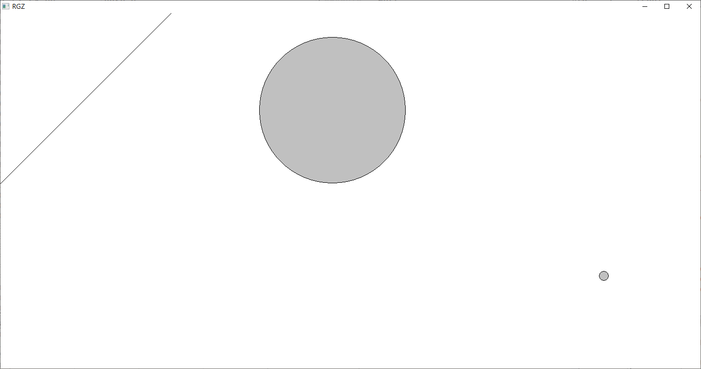

**Постановка задачи**: Шар представлен в виде координаты центра и радиуса, проекциями вектора скорости на оси Ox и OyОтскакивание шарика от стенок окна осуществляется инверсией знака одной из компонент скорости. При коллизии с другими примитивами инверсируются знаки обеих компонент скорости. Коллизия с линией проверяется по формуле функции прямой проходящей через 2 точки, а коллизия с окружностью по формуле принадлежности точки окружности. 

